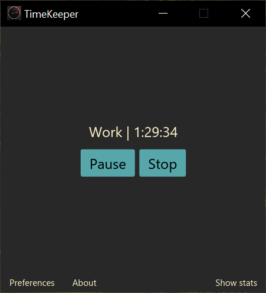

<div align="center">
    
    <h1>⏳ TimeKeeper</h1>
    <p><b>Управляйте своим рабочим временем за ПК эффективно!</b></p>
    <h4>
        <a href="https://mskrasnov.github.io/TimeKeeper/screenshots.html">Скриншоты</a>
        <span> | </span>
        <a href="https://github.com/mskrasnov/TimeKeeper/releases">Релизы</a>
    </h4>
</div>

## Что такое TimeKeeper?

TimeKeeper - простейшая кроссплатформенная программа для учёта рабочего времени за ПК. Она нужна для того, чтобы периодически напоминать пользователю о необходимости выполнения перерывов за работой на ПК.



## Идея

Многие люди не делают перерывы в работе за ПК. Как итог - снижение эффективности такой работы ввиду усталости, проблемы с опорно-двигательным аппаратом из-за сидячего образа жизни и всевозможные нарушения зрения. Следовательно, пользователям нужна какая-либо простейшая программа, которая, подстроившись под их ритм работы, смогла бы напоминать им о необходимости сделать перерыв в работе.

Программа предназначена на использование людьми, подверженным высоким зрительным нагрузкам и/или ведущим сидячий образ жизни.

## Мотивация

1. Я нуждался в кроссплатформенной программе для учёта рабочего времени. Такая программа должна быть простой, легковесной и достаточно функциональной.
2. Многие люди забывают делать перерывы в работе за компьютером, что пагубно сказывается на их продуктивности и здоровье. Сделай перерыв - разомнись, подыши свежим воздухом и продолжай работу. Это замедлит ухудшение твоего здоровья.
3. Мне нужно было попрактиковаться в разработке десктопного ПО на языке Rust. TimeKeeper - это второй проект, первый - [ice](https://github.com/mskrasnov/ice).
4. TimeKeeper является продуктом к проекту, реализованного в рамках дисциплины "Проектная деятельность" в моём универе.

## Преимущества

1. **Offline.** TimeKeeper не требует для своей работы браузера и доступа в Интернет.
2. **Кроссплатформенность.** Наша программа корректно работает в операционных системах Windows и Linux и не зависит от большинства внешних библиотек вроде Qt и GTK.
3. **Минималистичность.** TimeKeeper занимает не более 20 Мб на жёстком диске и способна работать даже на слабых ПК.
<!--4. [TODO] **Статистика.** TimeKeeper способен вести локальную статистику циклов работа/отдых, чтобы пользователь имел представление о том, сколько он работает и как часто нужно делать перерывы в работе.
5. [TODO] **Уведомления.** Вне зависимости от ОС, на которой запускается TimeKeeper, на ваш рабочий стол будут приходить уведомления о начале/конце цикла работа/отдых.-->

## Установка

### Готовый билд программы

Перейдите на вкладку [Releases](https://github.com/mskrasnov/TimeKeeper) и скачайте последний *стабильный* релиз для вашей операционной системы. Сейчас поддерживаются только Windows (x86_64) и Linux (glibc x86_64, aarch64).

### Сборка из исходного кода

**Зависимости:**

- Инструментарий языка программирования Rust (можно установить с помощью `rustup`);
- **Windows:** MSVC;
- **Linux:** `binutils`, `gcc`, Xorg/Wayland

**Сборка под Windows:**

```ps
cargo build --release
.\target\release\time_keeper
```

**Сборка под Linux:**

```bash
sudo apt install build-essential -y

cargo build --release
./target/release/time_keeper
```

## Стек технологий

- **ОС:** Windows, Linux
- **Мультиязычность:** на данный момент отсутствует
- **ЯП:** [Rust](https://rust-lang.org)
- **GUI:** [iced](https://iced.rs)